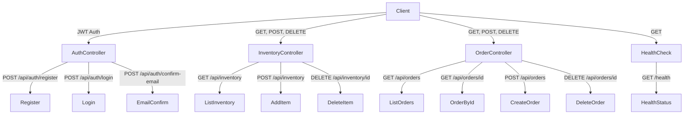

# LogiTrack API


Production-ready ASP.NET Core API for inventory and order management, built as a Microsoft Backend Capstone project.

## Features
- Entity Framework Core (SQLite)
- ASP.NET Core Identity & JWT authentication
- Role-based authorization
- In-memory caching
- Optimized queries
- Health checks & global error handling
- Docker support
- Azure Pipelines CI/CD (simulation)

## API Route Overview



## Quickstart

1. Clone the repo and restore dependencies:
   ```sh
   git clone <your-repo-url>
   cd BackendCapstoneProject
   dotnet restore
   ```
2. Run locally:
   ```sh
   dotnet run --project LogiTrack/LogiTrack.csproj
   ```
3. Build and run with Docker:
   ```sh
   cd LogiTrack
   docker build -t logitrack-api .
   docker run -p 5000:5000 logitrack-api
   ```

## Documentation
- See the `docs/` folder for architecture, API docs, test plans, Docker, and CI/CD details.

---

© 2025 Fares Chehidi.
