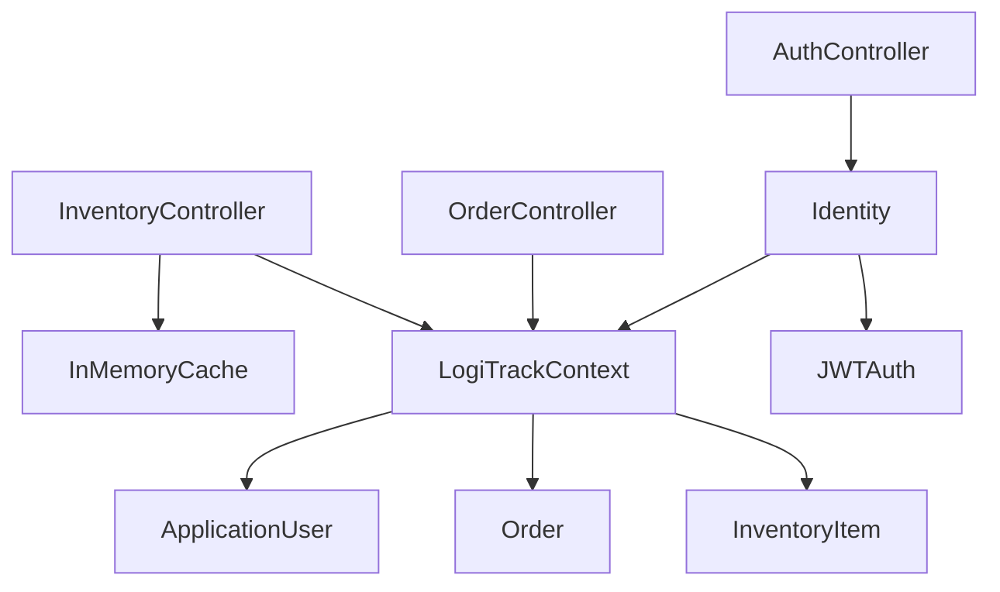

# LogiTrack Backend Architecture Overview

> **Context:**
> This project was developed as a capstone for the Microsoft Backend Professional Certificate. It demonstrates the application of modern backend engineering principles, best practices, and .NET technologies in a real-world inventory and order management scenario. The solution is designed to showcase proficiency in API design, security, performance optimization, and maintainability, as required by the certification program.

## 1. Methodology
- **Domain-Driven Design (DDD) Principles:** Clear separation of concerns between models, data access, and controllers.
- **Best Practices:** Emphasis on security, performance, maintainability, and scalability.
- **API-First Development:** Designed with OpenAPI/Swagger for easy testing and documentation.

## 2. Frameworks & Technologies
- **ASP.NET Core**: Main web API framework.
- **Entity Framework Core**: ORM for data access and migrations.
- **ASP.NET Core Identity**: Authentication and role-based authorization.
- **JWT Bearer Authentication**: Secure, stateless API access.
- **In-Memory Caching**: For performance optimization.
- **Swagger/OpenAPI**: For API documentation and testing.

## 3. Solution Structure

- **LogiTrack/Models/**
  - `InventoryItem.cs`, `Order.cs`, `ApplicationUser.cs`: Domain models.
- **LogiTrack/Data/**
  - `LogiTrackContext.cs`: EF Core DbContext, inherits from IdentityDbContext.
- **LogiTrack/Controllers/**
  - `InventoryController.cs`, `OrderController.cs`, `AuthController.cs`: API endpoints, business logic, and security.
- **LogiTrack/Properties/**
  - `launchSettings.json`: Environment and launch configuration.
- **docs/**
  - Documentation, test plans, and architecture diagrams.

## 4. Key Design Specifics
- **Caching:** In-memory caching for inventory GET endpoints, with cache invalidation on data changes.
- **Optimized Queries:** Use of `.AsNoTracking()`, eager loading, and selective fetching for performance.
- **Role-Based Security:** Manager-only endpoints for sensitive operations.
- **Performance Monitoring:** Custom headers for timing and cache status.
- **Pagination:** Supported on all list endpoints for scalability.

## 5. Component Diagram

---

This architecture ensures a robust, secure, and high-performance backend tailored for inventory and order management, leveraging modern .NET technologies and best practices.
